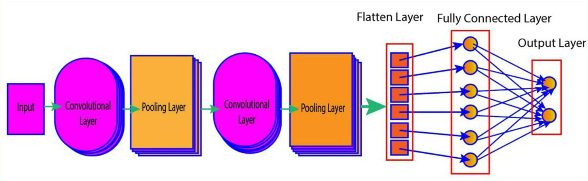

## Convolutional Neural Network for Digit Recognition
___

##  Описание слоев модели CNN.
* ### Слой Input: 
Задает форму входных данных, ожидаемых моделью. 
* ### Сверточные слои (Conv2D): 
Эти слои выполняют операции свертки, которые помогают модели извлекать ключевые признаки из изображений, 
такие как края, текстуры и формы.
* ### Слои подвыборки (MaxPooling2D): 
Эти слои уменьшают размерность данных, сохраняя при этом важные признаки, 
что помогает ускорить обучение и снизить риск переобучения.
* ### Слой подвыборки GlobalAveragePooling2D :
Этот слой выполняет операцию глобального усреднения по всем пространственным измерениям (ширина и высота) входных данных, 
оставляя только одну характеристику на канал.
Используется в CNN, чтобы уменьшить размерность после сверточных слоев, сводя информацию о пространственных признаках 
(например, изображения) к одному числовому значению для каждого канала. 
Это помогает в последующей классификации, где вместо использования больших матриц выходных признаков используется вектор меньшего размера.
* ### Слой преобразования Flatten 
Это слой, который преобразует многомерный входной тензор в одномерный вектор. 
Используется в конце сверточных слоев перед подачей данных в полносвязные слои 
(например, в классификационные модели), чтобы перейти от пространственного представления 
(например, изображения) к линейному представлению, которое подходит для обработки в полносвязных слоях.
* ### Слой регуляризации Dropout
Это слой регуляризации, который случайным образом отключает (обнуляет) определённую долю входных нейронов во время тренировки, 
чтобы предотвратить переобучение модели. 
* ### Полносвязные слои (Dense): 
Эти слои отвечают за классификацию, принимая вектор признаков от предыдущих слоев 
и принимая решение о классе (цифре) изображения.

