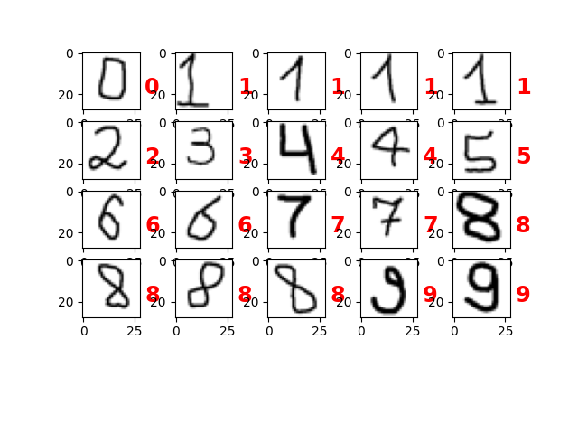

# Convolutional Neural Network for Digit Recognition 

### [Слои модели CNN - Описание ...](./README-layers.md)


## Линейная модель CNN Sequential [ Обновленная Модель_2 CNN :](./cnn2.txt)

* ## 1. Слой Input
Входные данные — изображения размером 28x28 пикселей с одним каналом (градации серого).
* ## 2, 3. Два первых слоя свертки (Conv2D):
Эти слои применяют 64 фильтра размером 3x3 к входным данным, извлекая важные признаки, такие как края и текстуры.
Активация relu.
* ## 4. Первый слой подвыборки (MaxPooling2D):
Уменьшает размерность данных, агрегируя значения в области 2x2 пикселя и выбирая максимальное значение в каждой области.
Помогает уменьшить количество параметров и вычислительные затраты, сохраняя важные признаки.
* ## 5. 6. Два вторых слоя свертки (Conv2D):
Применяют 128 фильтров размером 3x3 к данным, извлекая более сложные признаки.
Активация relu.
* ## 7. Второй слой подвыборки (GlobalAveragePooling2D):
Уменьшает размерность после сверточных слоев, сводя информацию о пространственных признаках изображения к одному числовому значению для каждого канала. 
Выполняет операцию глобального усреднения.
* ## 8. Слой выравнивания (Flatten):
Преобразует многомерный массив данных в одномерный вектор. Для дальнейшего подключения к полносвязным (Dense) слоям.
* ## 9. Полносвязный слой (Dense):
Обрабатывает данные, используя 128 нейронов. 
В каждом нейроне происходит линейная комбинация входных данных и применение функции активации relu.
* ## 10. Слой Dropout
Используется для регуляризации нейронной сети - случайным образом обнуляет (выключает) определённую долю нейронов (0.5 = 50%) в слое 
во время обучения, что помогает предотвратить переобучение модели. 
Уменьшает зависимость модели от конкретных нейронов.
* ## 11. Выходной полносвязный слой (Dense):
Обрабатывает выходные данные и использует 10 нейронов, соответствующих 10 классам (цифры 0-9). 
Применяет функцию активации softmax для получения вероятностей классов.
(softmax - нормализует выходные значения, преобразуя их в вероятности классов, которые суммируются до 1)

___

**x_train** - cодержит данные, используемые для обучения модели нейросети.

**x_test** - cодержит данные, используемые для тестирования производительности обученной модели. 

___

### Параметры обучения: 

* ### Оптимизатор Adam (Adaptive Moment Estimation): 
адаптируется к обучению моделей, изменяя скорость обучения на основе момента первого и второго порядка. 

* ### Функция потерь sparse_categorical_crossentropy:
используется для задач многоклассовой классификации, где метки представлены в виде целых чисел. 
Измеряет разницу между предсказанными вероятностями и истинными метками. 

* ### Метрика accuracy, по которой будет оцениваться производительность модели. 
Показывает, какой процент предсказаний модели правильный. 


#### * здесь - [(Первоначальная модель CNN)](./README-model1.md)

___
### Используем **callback**-и 
 для тренировки модели (параметры model.fit) для контроля процесса обучения, улучшая его эффективность и удобство:
* ### EarlyStopping:
останавливает тренировку, если метрика, которую мониторим (**val_loss** — потери на валидационной выборке), не улучшается в течение 5 эпох (параметр **patience**=5).
* ### ModelCheckpoint:
сохраняется лучшая модель во время тренировки - модель, которая на данный момент имеет минимальные потери на валидационной выборке.
* ### ReduceLROnPlateau:
снижает скорость обучения в два раза (**factor**=0.5), если метрика (**val_loss**) перестает улучшаться. Это помогает модели лучше сходиться, если она "застряла" в локальном минимуме.
* ### CSVLogger:
Записывается информацию о процессе тренировки (значения потерь и точности на тренировочной и валидационной выборках) в файл CSV.

___
### Tech Stack & System requirements :

* Python 3.+
* TensorFlow 
* Keras
* Numpy 
* Matplotlib

## How to use: 

### Создание модели (cnn_digit02.keras) -  Train & Test:
```
py cnn_model_v2.py
```

### Тест всех .keras моделей для всех изображений в папке ```data/```
```
py test_load.py
```

### Результаты обновленной модели на нестандартных входных данных:


